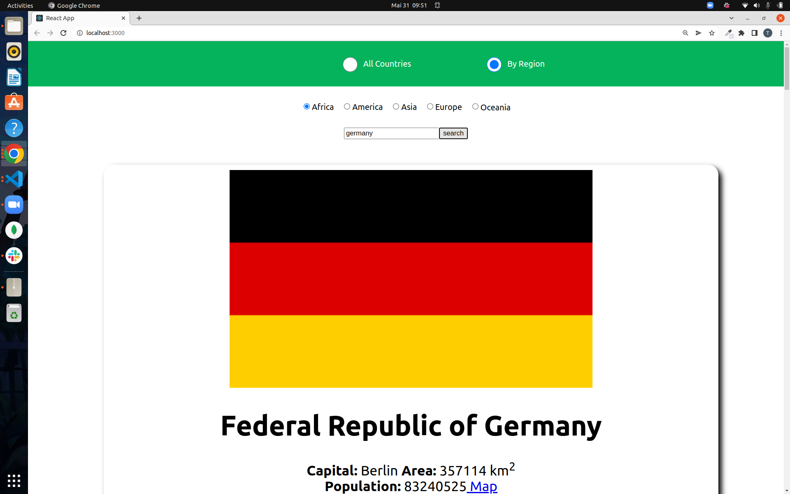

# SPA-countries-app

## preparation:
- clone the repo
- type npm i

## tasks:

- in AllCountries component:
1) fetch all the countries on load from restcountries using this URL https://restcountries.com/v3.1/all

2) save the received array of countries in a local state {countries} and prevent an infinite render

3) show each country in the array {countries} using the template component CountryCard

- in ByRegion component:
4) fetch the countries on load by their region using this URL https://restcountries.com/v3.1/region/{region}  give the {region} an initial value in a local state. 

5) save the received array of countries in a local state {countries} and make sure that the fetch happens only when {region} (in the local state) changes. 

6) show each country in the array {countries} using the template component CountryCard

7) give the user the ability to change the region to one of the following: (Africa, Americas, Asia, Europe, Oceania) by using input type radio which should change the region in the local state (check the rad-list in App.js as a reference for radio) 

8) add a form that has an input field (type text) and a button, save the user input in a local state then use it to fetch a country by name onSubmit using this URL https://restcountries.com/v3.1/name/{name}

9) save the received object of the searched country in a local state {country} then show it using the component searchResult

10) edit the fetch that happens on load so that it runs only when the {region} changes.

