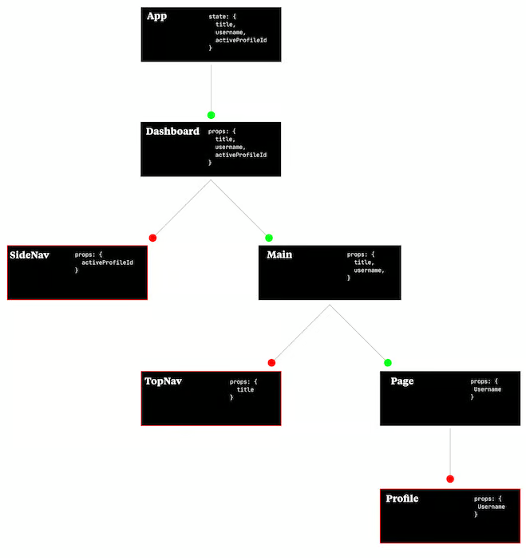

# Context API

## What is global state
In the context of React and state management, the term "global state" refers to data or state that is shared and accessible across multiple components in your application. It represents data that is not limited to a specific component but needs to be accessed or updated from different parts of your application.

By Having a global state, you can avoid prop drilling, which is the process of passing props down from parent components to deeply nested child components. Instead, you can define the shared data at a higher level and access it directly in the components that need it.

---
Prop drilling example:





---
With the <strong>Context API </strong>, you can create a single source of truth for your global state and provide a centralized way to access and update it. It simplifies the management of shared data and reduces the need for prop drilling or complex state lifting patterns.


To set up the Context API in React, follow these steps:

Step 1: Create a Context
First, you need to create a new context. This can be done using the createContext function from the react package. In a new file, create a context object:

```
// MyContext.js
import React from 'react';

const MyContext = React.createContext();

export default MyContext;
```

Step 2: Create a Provider
Next, you'll create a provider component that will wrap the parts of your application that need access to the context data. The provider component will be responsible for providing the data and any necessary functions to the consuming components.

```
// MyProvider.js
import React, { useState } from 'react';
import MyContext from './MyContext';

const MyProvider = ({ children }) => {
  const [data, setData] = useState('Initial data');

  // Define any functions or state you want to provide
  const updateData = (newData) => {
    setData(newData);
  };

  return (
    <MyContext.Provider value={{ data, updateData }}>
      {children}
    </MyContext.Provider>
  );
};

export default MyProvider;
```

Step 3: Wrap your App with the Provider
Finally, wrap your root component or any component that needs access to the context with the provider component you created:

```
// Index.js
import React from 'react';
import ReactDOM from "react-dom/client";
import MyProvider from './MyProvider';
import App from "./App.jsx";


ReactDOM.createRoot(document.getElementById("root")).render(
    <MyProvider>
      <App />
    </MyProvider>
);
```


Step 4: Consume the Context
To use the context in your components, you can use the useContext hook provided by React. Import the context object you created earlier and use it within your component:


```
// MyComponent.js
import React, { useContext } from 'react';
import MyContext from './MyContext';

const MyComponent = () => {
  const { data, updateData } = useContext(MyContext);

  return (
    <div>
      <p>Data: {data}</p>
      <button onClick={() => updateData('New data')}>
        Update Data
      </button>
    </div>
  );
};


export default MyComponent;
```


