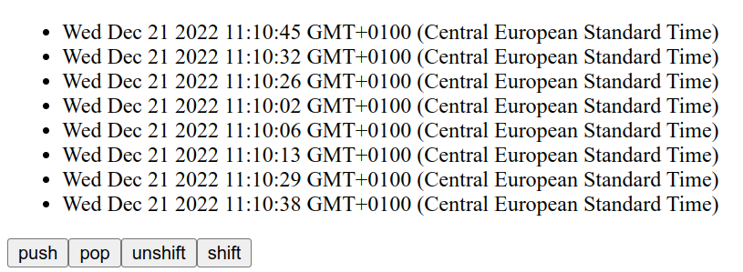

# Array Methode Simulation

## Aufgabe

Erstelle eine kleine Webseite, die ein Array aus Datums-Objekten darstellt.

Es soll vier Buttons geben für die grundlegenden Array-Methoden:

- push
- pop
- unshift
- shift

## Hinweise

1. Erstelle drei Komponenten:
   - ArraList
   - ArrayEntry
   - Controls (Für die Buttons)
2. Wenn in der Controls-Componente ein Button gedrückt wird, soll eine Funktion aus der Hauptkomponente (App) aufgerufen werden (onPush, onPop, onUnshift, onShift).
3. In der App Komponente soll ein Array als Initialwert des States mit **useReducer** erstellt werden.
4. Die reducer-Funktion soll alle vier Fälle bearbeiten und das Array entsprechend anpassen/ersetzen.
5. Bei den _Actions_ **push** und **unshift** muss das Action-Objekt ein payload/Daten haben.
6. Zum Ändern des Arrays benutze am besten den Spread-Operator und/oder die slice() Methode.
