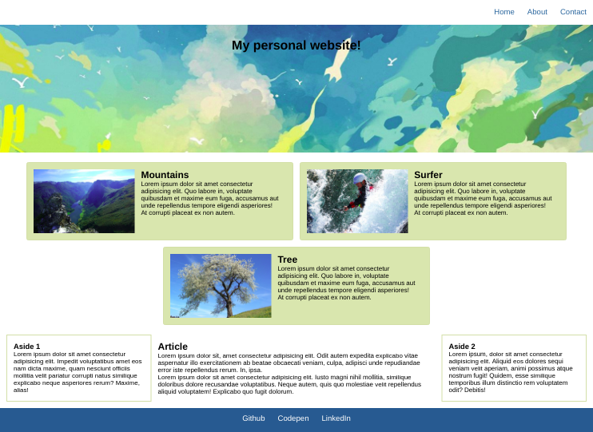

# Sassy Website

Erstelle eine Mockup-Website, wie sie im [Referenzbildordner](./images_reference) zu sehen ist.

**Anleitung**:

* Um dieses Projekt zu starten, verwende `npm run start`.
* Der Startcode befindet sich im Ordner `src`. Arbeite in den vorhandenen Dateien.
* Schreibe deine Styles mit Sass.
* Nutze nesting und Variablen, wo es möglich ist.
* Achte darauf, dass du zuerst für Mobilgeräte designst!

* Nutze Flexbox, um die Darstellung der Elemente auf der Seite je nach Bildschirmgröße zu ändern.
* Elemente mit der Klasse `.card` sollten die Variable `$secondary-color` als Hintergrundfarbe verwenden.
* Elemente mit der Klasse `.card` sollten die Variablen `$border-size` und `$secondary-color` für den Rahmen verwenden.
* `aside` sollte die Eigenschaft `border` mit den Variablen `$border-size` und `$secondary-color` definiert werden.

* Haltepunkte:
    - 768px - Tablet (die Breite von `.card` sollte 80% betragen)
    - 1024px - Desktop (`children` des `.cards` Containers sollten mit der css-Eigenschaft `jusitify-content` zentriert werden)

* Farben für das Styling:
    - Hintergrundfarbe der Karte: #e0ddb2
    - Karten- und Seitenrandfarbe: #e0ddb2
    - Farbe für Nav und Footer: #0e749e
* Verwende die Bilder im Ordner [images](./src/images) für die Kopfzeile und die Karten.

